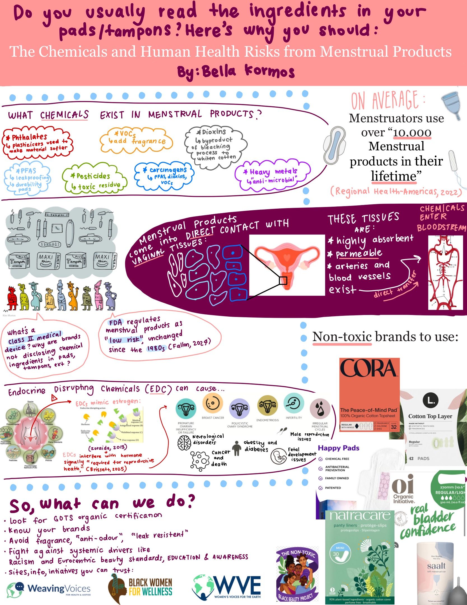

## The Chemicals and Human Health Risks from Menstrual Products 
{width=150% fig-pos="H"}

**Why does this infographic matter?**

My key message is simple: menstruators deserve to know what they are putting in and on their bodies.  This infographic was designed with all menstruators in mind, but specifically college students who may not even consider reading the ingredient lists in menstrual products. I hope to spread awareness of the chemicals present in menstrual products, and to educate menstruators on possible chemical exposures and health risks to using non-organic products. Before I started this research, I never thought about the possibility that my menstrual products could be exposing me to endocrine disrupters and carcinogens. 

Students have so much on their plate balancing classes, work, social life, and more. Generally, college students are also on a strict budget, and don’t prioritize/can’t afford organic, non-toxic personal care products. I hope this infographic and site can bring awareness to the toxic effects of many common menstrual brands, and to inspire those who have access and the means to support clean brands and AVOID toxic brands. 

The information compiled here, including the routes of exposure, the chemicals present, the health risks, was drawn from peer-reviewed scientific findings and converted into a readable, accessible format. I  illustrated this infographic by hand on my iPad, and then coded it into a website using R. My hope is that this information is scrollable, shareable, and digestible even on a busy day between classes.

This work promotes understanding of clean menstrual brands and encourages menstruators to take toxic chemicals seriously. We are living in an industrial, chemical-filled world where corporations are not held to adequate testing or regulatory standards for personal care products. Until meaningful legislative and policy change is enacted, the burden of protection falls on the consumer. This isn’t fair because consumers don’t have access to the information they need to make informed choices. This site is my attempt to close that gap. I hope this information productively educates consumers on the chemicals they most likely don’t know they are absorbing directly into their bloodstream. 

I understand this information is frightening, and some may think it’s better to not know. However, these chemical exposures can disrupt hormones, affect fertility, cause cancer, and can truly reshape entire futures. Share this link, educate yourself, support clean, non-toxic initiatives and brands. There is always something you can do, but the first powerful step is to simply be aware. 

**Works Cited:**

Fallon, M. (2024) “Reckless Regulation: The Frightening Truth Behind Feminine Hygiene Products”, Elon Law Review. https://eloncdn.blob.core.windows.net/eu3/sites/996/2024/02/Fallon.pdf

Regional Health-Americas TL, "Menstrual Health: A Neglected Public Health Problem," Lancet Regional Health – Americas 15 (2022): 100399, https://doi.org/10.1016/j.lana.2022.100399.

Sosa-Ferrera, Zoraida, Cristina Mahugo-Santana, and José Juan Santana-Rodríguez. "Analytical Methodologies for the Determination of Endocrine Disrupting Compounds in Biological and Environmental Samples." BioMed Research International 2013 (2013): 674838. https://doi.org/10.1155/2013/674838. 

